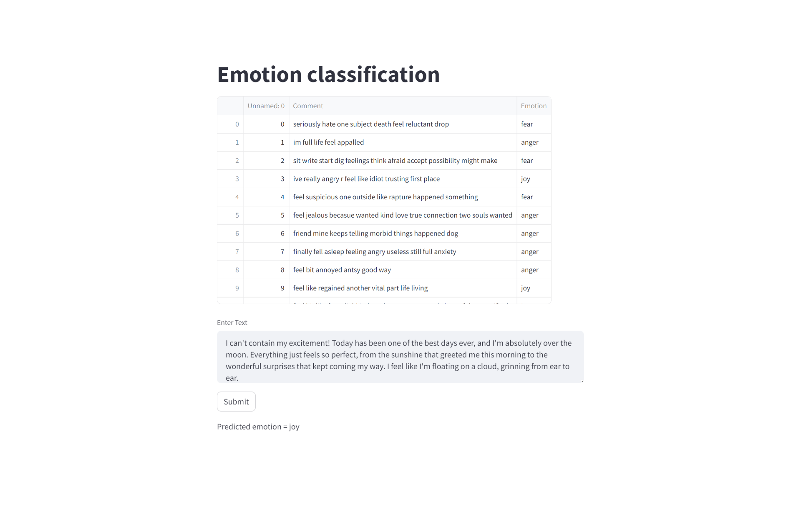

<h1>Emotion classification using Logistic Regression</h1>
<h2>Description of the project</h2>
  
There are three category of emotion in the dataset which are fear, anger and joy. Here the classifier takes a given text as an input and outputs one of the three emotion based on the text.

<h2>Output in streamlit</h2>

